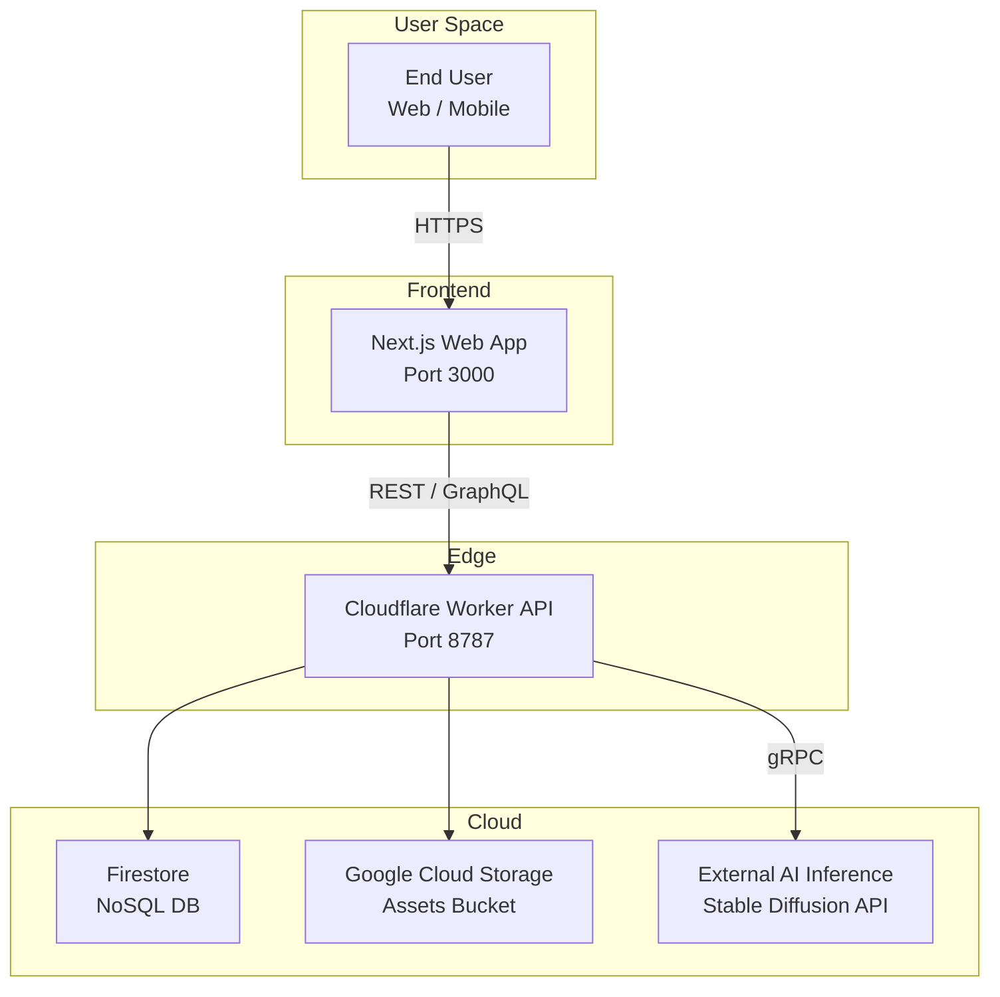

# 🏗️ High‑Level System Architecture

This document provides a bird’s‑eye view of **Story Generator New** so that engineers and coding agents can understand how the pieces fit together before diving into feature code.

## 1. C4 — System Context

### Components

| Layer | Responsibility | Tech / Package |
|-------|----------------|----------------|
| **Frontend** | UI, routing, client‑side validation, Storybook | Next.js 14, React 19, TypeScript |
| **Edge Worker** | Auth, rate‑limiting, BFF, where business logic lives | Cloudflare Workers, Hono Router |
| **Persistence** | Authoritative data store | Firestore (Native mode) |
| **Asset Storage** | User‑uploaded images, audio, etc. | Google Cloud Storage |
| **External AI** | Avatar generation, text embeddings | Third‑party API (Stable Diffusion‑based) |

## 2. Data Flow Summary

1. **User signs in** → OAuth token → Cloudflare Worker verifies JWT with Firebase Auth.
2. **Frontend calls** `/api/generateStory` with story config.
3. **Worker orchestrates**:
   * Stores config in **Firestore**.
   * Calls **AI Inference** to create media assets.
   * Uploads assets to **GCS** and writes URLs back to Firestore.
4. **Frontend subscribes** to `onSnapshot` updates for real‑time progress.

## 3. Non‑Functional Requirements

| Concern | Target |
|---------|--------|
| **Latency** | ≤ 200 ms p95 for read endpoints |
| **Throughput** | Burst 100 RPS per user story submission |
| **Availability** | 99.9 % monthly SLA |
| **Security** | All data in transit via TLS 1.3; secrets via CF environment variables |
| **Compliance** | GDPR, CCPA ready (user data export/delete via Firestore security rules) |

---

_Update this diagram whenever a new major component or data flow is introduced, and bump `lastReviewed`._
