# 🛠️ CI/CD Pipeline

Our GitHub Actions pipeline enforces quality gates and automates deployments.

## 1. Workflow Overview

```mermaid
graph LR
  C[Commit / PR] --> Lint[🔍 Lint & Format]
  Lint --> Test[✅ Unit & Integration Tests]
  Test --> Typecheck[🔡 TypeScript Typecheck]
  Typecheck --> Bundle[📦 Bundle Size Guard]
  Bundle --> Build[⚙️ Build Artifacts]
  Build --> DeployStage[🚀 Deploy to Staging]
  DeployStage --> E2E[E2E Tests]
  E2E --> Approve[Manual Approval]
  Approve --> DeployProd[🌐 Deploy to Production]
```



### Key Jobs

| Job | Trigger | Required? | Notes |
|-----|---------|-----------|-------|
| `lint` | push / PR | ✅ | `pnpm lint && pnpm format:check` |
| `test` | push / PR | ✅ | `pnpm test` (Vitest, Playwright) |
| `typecheck` | push / PR | ✅ | `pnpm typecheck` |
| `bundle-size` | PR | ✅ | Fails if bundle grows >5 kB gzipped |
| `build` | push to `main` | ✅ | Produces Next.js & Worker artifacts |
| `deploy-staging` | merge to `main` | ✅ | Cloudflare Pages preview |
| `e2e` | post‑deploy | ✅ | Runs Playwright against staging URL |
| `deploy-prod` | manual dispatch | ✅ | Requires 1 human approval |

## 2. Secrets & Envs

| Secret | Scope | Description |
|--------|-------|-------------|
| `CF_API_TOKEN` | Deploy jobs | Auth for Cloudflare |
| `GCP_KEY` | Build & deploy | Upload assets to GCS |
| `OPENAI_API_KEY` | Build | Codegen scripts (optional) |

Secrets are configured in **GitHub → Settings → Secrets → Actions**.

## 3. Caching

* **PNPM Store** cached via `actions/setup-node`.
* **Playwright browsers** cached separately to cut E2E job time.

## 4. Failure Policies

* Red CI blocks merge.  
* Staging deploy failures trigger Slack alert `#dev‑alerts`.  
* Prod deploys can be **rolled back** via `Cloudflare → Pages → Rollback`.

## 5. Local Reproduction

```bash
pnpm ci:local   # runs lint, test, typecheck locally
```

Match CI node version with `nvm use`.

---

_Keep this doc in sync whenever the GitHub Actions YAML changes._
